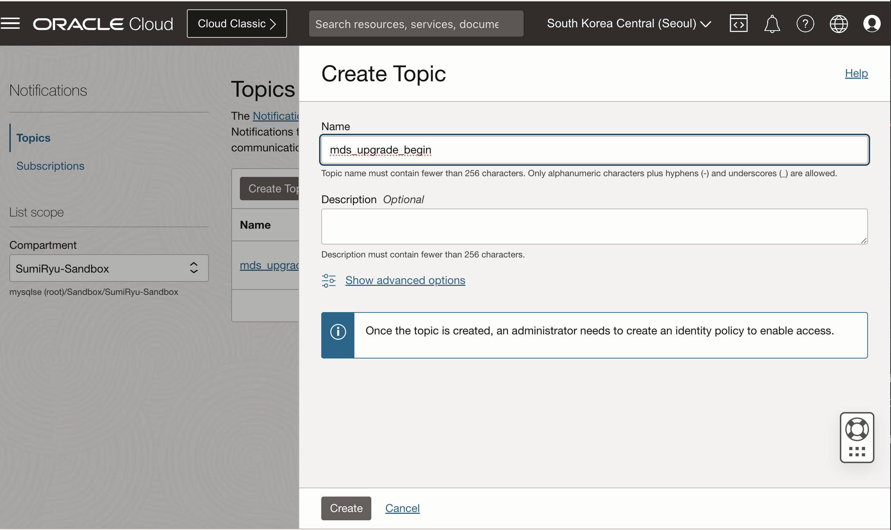
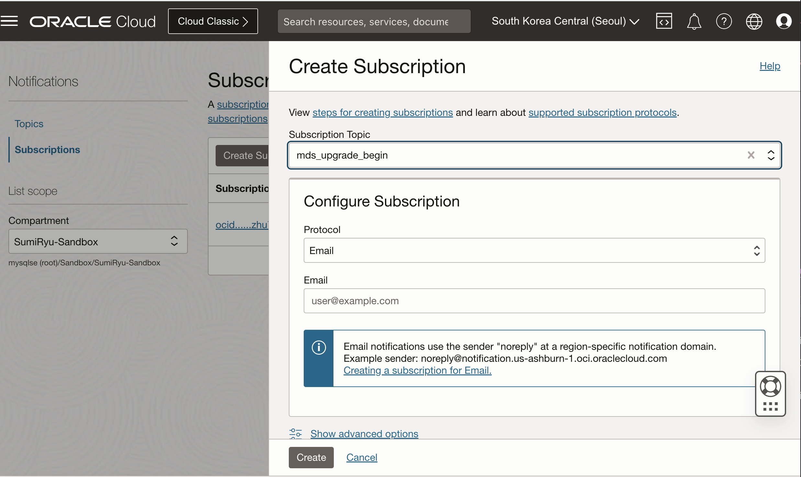
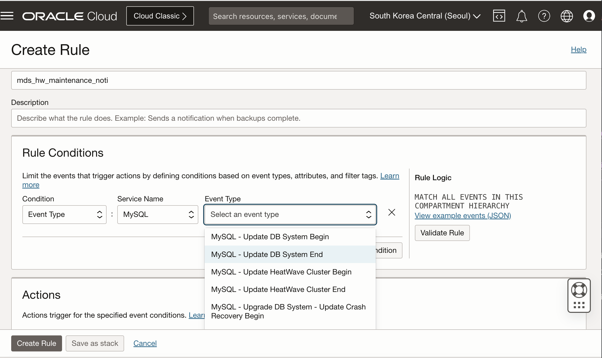
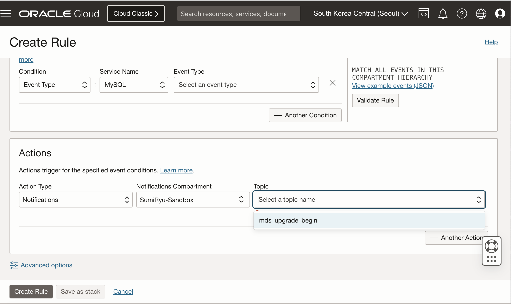

## MDS_HeatWaveMaintenanceNotification
How to subscribe MDS and HeatWave Maintenance Notification
MDS 및 HeatWave의 maintenance 시작과 종료에 대한 알람을 설정할 수 있음(email)

### 1. 노티를 위한 Topic 생성 (create a topic for the notification)
- Developer Services > Application Integration > Notifications

### 2. 구독 생성 (Create a subscription with your email address)

### 3. MDS/HeatWave Event Rule 생성

OCI Console에서 햄버거 메뉴 선택 후 
Observability & Management > Events Service > Rules 
Events Service 설정
- Create Rule (Rule 생성)

- Set the Actions for mysql notifications

### 참고자료
- [권기혁 님 Github ](https://github.com/khkwon01/MySQL_Q-A/blob/main/README.md)

- [Oracle Cloud 메뉴얼 ](https://docs.oracle.com/en-us/iaas/Content/Notification/Tasks/create-topic.htm?Highlight=%08topic)

